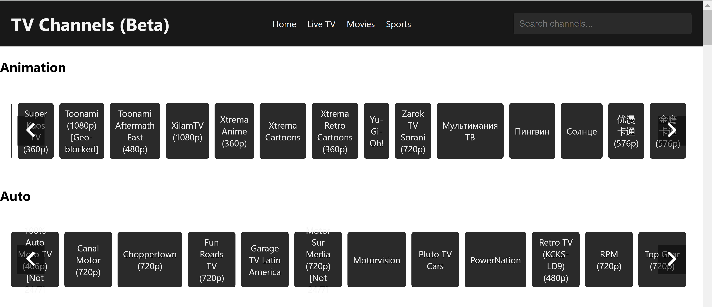
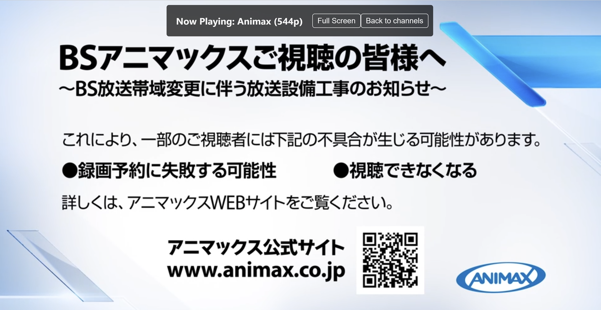

# Free IPTV Channels App

## Overview

The **Free IPTV Channels App** is a user-friendly application that allows users to stream free channels from various sources using IPTV technology. Designed for simplicity and efficiency, the app provides an engaging viewing experience for users looking for diverse content.

## Features

- **Access to Free Channels**: Enjoy a wide range of free TV channels from various genres.
- **Responsive UI**: A custom, smooth user interface that enhances user experience.
- **Easy Navigation**: Simple and intuitive navigation to find channels quickly.
- **Cross-Device Compatibility**: Plans to expand accessibility across different devices.

## Screenshots

Below are some screenshots showcasing the app's interface and features:

 <!-- Replace with actual screenshot path -->
 <!-- Replace with actual screenshot path -->

## Future Development Plans

We aim to enhance the **Free IPTV Channels App** further by:

- **Improving Performance**: Optimization to ensure smoother streaming experiences.
- **Expanding Channel Availability**: Integrating more channels from various regions, particularly focusing on Indian content.
- **Device Compatibility**: Making the app available on more devices (e.g., Smart TVs, tablets) for wider accessibility.
- **User Feedback Integration**: Actively collecting and integrating user feedback to improve functionality and user satisfaction.

### How You Can Help

- **Sponsorship**: Consider becoming a sponsor for the app.
- **Donation**: Any financial support is greatly appreciated and will be utilized directly for development.
- **Feedback**: Share your thoughts and suggestions for improving the app.

[Buy Me a Coffee](https://www.buymeacoffee.com/kamalsoni)

## Get Involved

If you're interested in supporting the **Free IPTV Channels App**, please reach out to us via [kamalsoni3839@gmail.com] for sponsorship details, or simply make a donation to support our development efforts.

## Acknowledgments

We would like to thank all our users for their support and feedback. Your input helps us create a better product!

